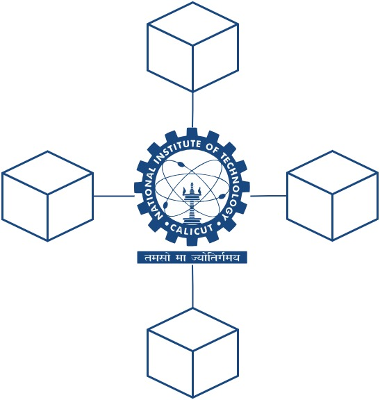

# NITC On Blocks

## Introduction
NITC on blocks is a custom blockchain implementation project aimed at understanding blockchains.
The project is planned in six stages and is programming language independent.
The end result is a custom blockchain with native cryptocurrency with miners and simulated block sealing by miners 
with transactions stored in Merkle Tree.

The blockchain is Proof of Work based with simulated miner block sealing and block reward system.
## About Us

Authors: The content in the website and the documentation has been authored in the Department of Computer Science and Engineering, National Institute of Technology Calicut under the guidance of [Dr. Vinod Pathari](https://sites.google.com/nitc.ac.in/pathari/). The project's activity started in the year 2023.

First version of this assignment was released as a part assignment for Foundations of Information Security for M23 batch in 2023.

First web version was released in 2024.

First course assignment and web versions were prepared by [Yugam Parashar](https://www.linkedin.com/in/yugam-parashar/).

 

## Get scripts after clone
📜 `npm install react-scripts --save`
## Available Scripts

In the project directory, you can run:

### `npm start`

Runs the app in the development mode.

Open [http://localhost:3000](http://localhost:3000) to view it in your browser.

NITC on blocks is a custom blockchain implementation project aimed at understanding blockchains.
The project is planned in six stages and is programming language independent.
The end result is a custom blockchain with native cryptocurrency with miners and simulated block sealing by miners 
with transactions stored in Merkle Tree. 
The blockchain is Proof of Work based with simulated miner block sealing and block reward system.

### `npm run build`

Builds the app for production to the `build` folder.\
It correctly bundles React in production mode and optimizes the build for the best performance.

The build is minified and the filenames include the hashes.\

## Learn More

You can learn more in the [Create React App documentation](https://facebook.github.io/create-react-app/docs/getting-started).

To learn React, check out the [React documentation](https://reactjs.org/).

Made with 

---
